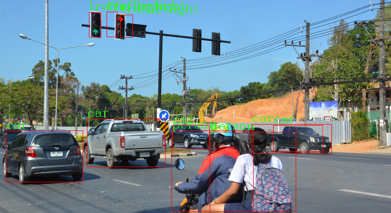

## Tensorflow Lite on Raspberry Pi (C++)

This article describe how to use the object detection model based on the tensorflow lite and opencv ( C++ version )

open the terminal and run the following code

``` shell
$ cd <root of the repo>/c++/1_tf_cv
$ g++ -O3 -DNDEBUG --std=c++11 object_detection.cc ../libtensorflow-lite.a -ldl -lutil -lstdc++ -lpthread -lm -lz -lopencv_core -lopencv_imgcodecs -lopencv_imgproc -I/home/pi/tensorflow -I/home/pi/tensorflow/tensorflow/lite/tools/make/downloads/flatbuffers/include -o ssd_detection
```

If there is no problem, you will find a binary file `ssd_detection` 

Then just run it 

```shell
$ .\ssd_detection
```

It will created a image file named `posttest.bmp` in this folder. That's what we need. Just copy it to our PC (using sftp or scp) and open it. 



Have a fun !


