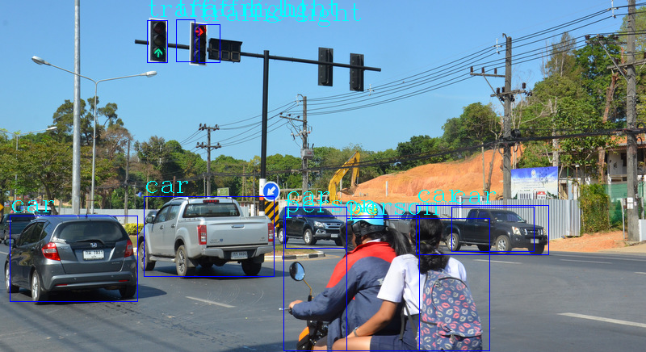

### Python Wrapper for tensorflow lite 

This article is for the python wrapper of  class `Detection` using tensorflow lite c++ . 

We have used the package [pybind11](https://pybind11.readthedocs.io/en/stable/index.html) .  Also, you need the tensorflow lite and opencv library. You can make a 

Here is the step: 


1. go to the `pybind` folder of the repo 

   ```shell
   $ cd <root of repo>/c++/2_pybind
   ```

2. run the following command to create a dynamic library for python wrapper

   ```shell
   $ g++ -DNDEBUG -O3 -Wall -std=c++11 -shared -fPIC `python -m pybind11 --includes`  detection.cpp ../libtensorflow-lite.a -ldl -lutil -lstdc++ -lpthread -lm -lz -lopencv_core -lopencv_imgcodecs -lopencv_imgproc -I/home/pi/tensorflow -I/home/pi/tensorflow/tensorflow/lite/tools/make/downloads/flatbuffers/include -o detection`python3-config --extension-suffix` 
   ```

3. run the python script 

   ```
   $ workon cv    # virtualenv
   $ python test.py
   ```

4. Voila, a new image in this folder 

   


